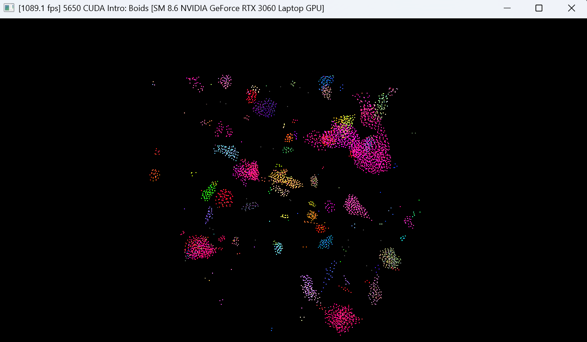
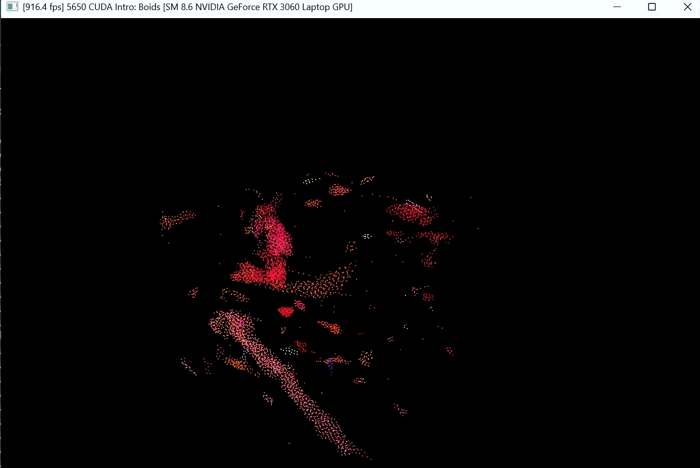
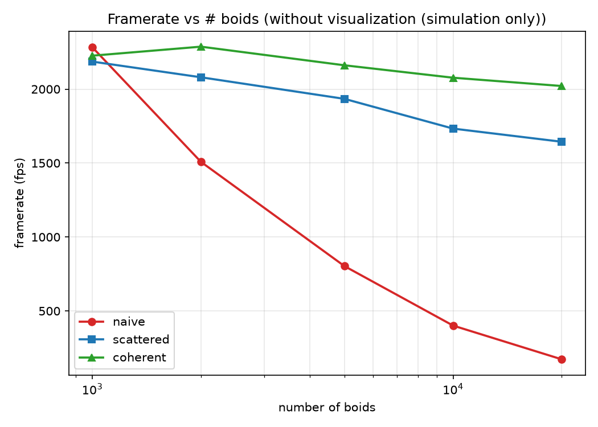
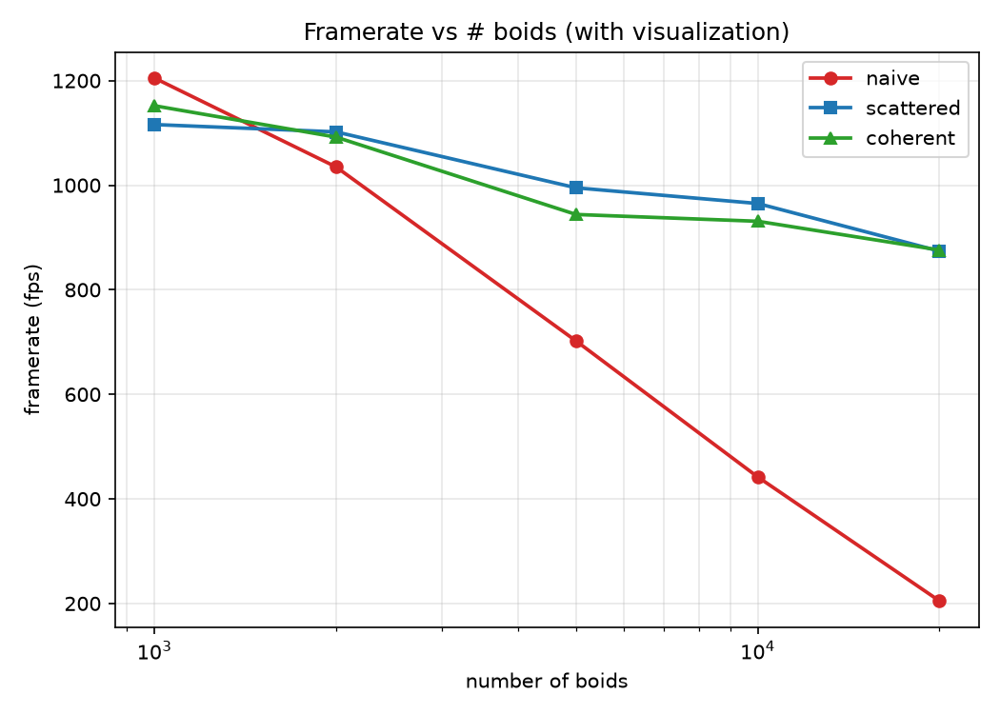
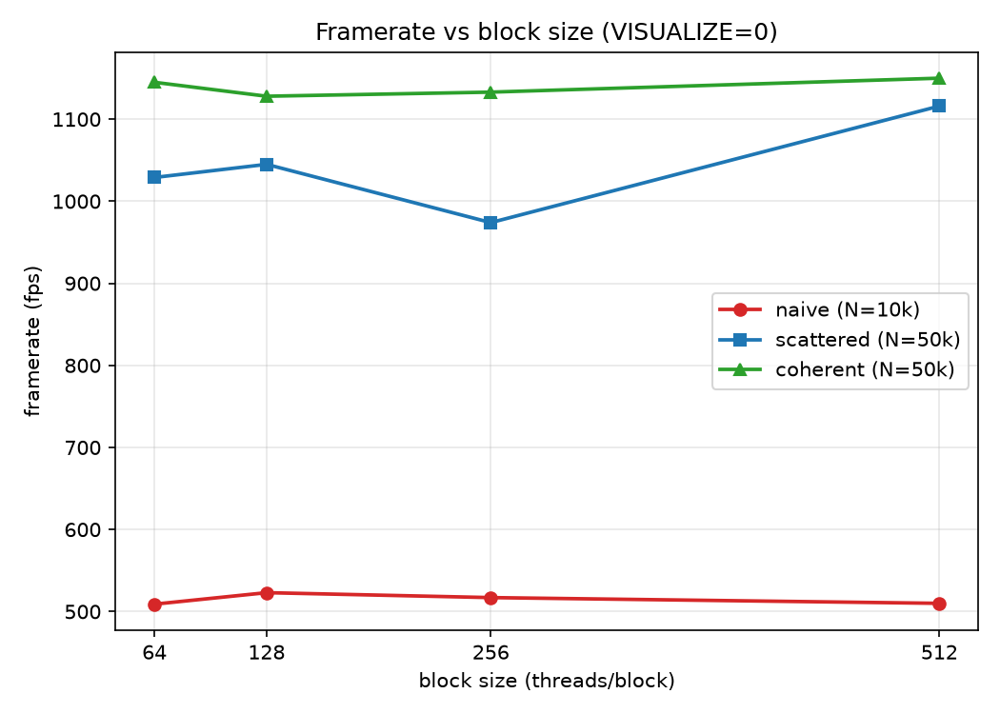
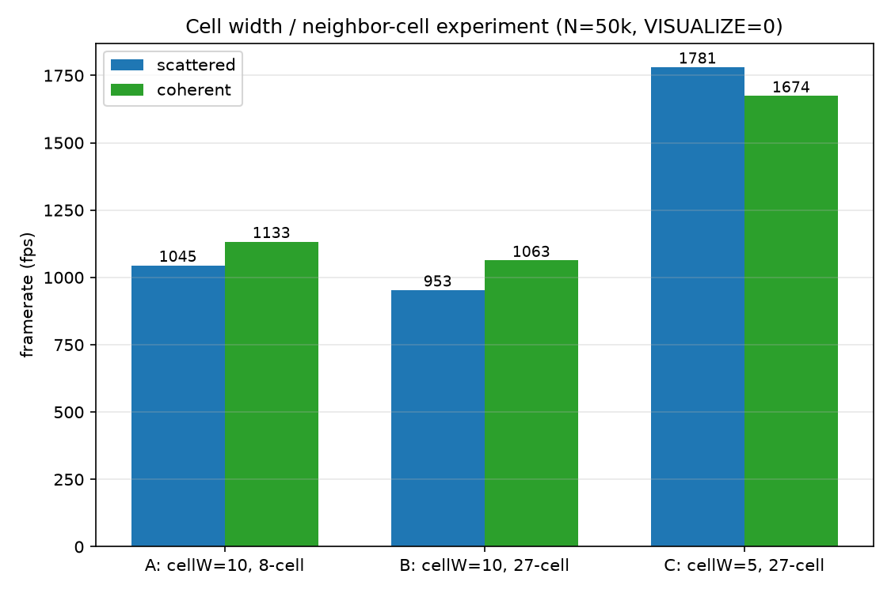

# Project 1: CUDA Boids Flocking

**University of Pennsylvania, CIS 5650: GPU Programming and Architecture,
Project 1 - Flocking**

* **Jing Huang**
  * [GitHub](https://github.com/Stabil1ze)
* Tested on: Windows 11, Intel i7-12700H @ 2.30GHz 23GB, NVIDIA GeForce RTX 3060 Laptop GPU 6GB (Personal computer)

## Demo

<!-- TODO: add a screenshot and a fixed-camera GIF of the running simulation here -->

*Boids flocking at the default settings (5000 boids).*

## Overview

This project implements the Reynolds **Boids** flocking simulation on the GPU in CUDA and
compares three neighbor-search strategies:

1. **Naive** — every boid checks every other boid for the three flocking rules
   (cohesion, separation, alignment).
2. **Scattered uniform grid** — boids are binned into a uniform grid by sorting;
   neighbor search is restricted to a few neighboring cells, but boid data is
   fetched through an indirection array.
3. **Coherent uniform grid** — boid positions/velocities are first *reordered* so that
   the boids of one cell are contiguous in memory; neighbor search then reads them
   sequentially with no indirection.

## Implementation

### Flocking rules

Each frame, every boid computes a velocity change from three rules applied to its
neighbors (boids within a fixed neighborhood distance):

* **Cohesion** — steer toward the perceived center of mass of neighbors (`rule1Distance = 5`).
* **Separation** — keep a minimum distance from neighbors (`rule2Distance = 3`).
* **Alignment** — match the average velocity of neighbors (`rule3Distance = 5`).

The new velocity is clamped to `maxSpeed = 1`. Because threads read their neighbors'
velocities concurrently, the sim uses **ping-pong velocity buffers** (read old `vel1`,
write new `vel2`, then swap) to avoid read/write races.

### Uniform grid (scattered)

The grid is rebuilt every frame:

1. `kernComputeIndices` labels each boid with its cell (1D `x + y·R + z·R²`) and its own array index.
2. `thrust::sort_by_key` sorts boids by cell so each cell's boids become contiguous.
3. `kernIdentifyCellStartEnd` (after `kernResetIntBuffer`) records each cell's `[start, end)`
   range in the sorted array.
4. `kernUpdateVelNeighborSearchScattered` walks the (up to) 8 neighboring cells and, for each
   candidate boid inside, resolves the real data slot through `dev_particleArrayIndices`.

With `gridCellWidth = 2 × maxNeighborDistance`, a boid's neighbors can only live in its own
cell plus the neighboring cell on the side the boid leans toward — 8 cells in total
(2×2×2). The direction is picked by comparing the boid's fractional position inside its cell
with `cellWidth / 2`.

### Coherent grid

The same grid is built, then:

1. `kernReorderData` **gathers** `pos/vel1` into cell-coherent buffers (`dev_*_sorted`)
   using the sorted index array.
2. `kernUpdateVelNeighborSearchCoherent` searches the 8 cells but reads `dev_*_sorted`
   **directly** (`[start, end)` indexes the data itself — one less level of indirection),
   iterating cells z→y→x (x innermost) to visit memory near-sequentially.
3. Positions advance in the sorted view, then `kernCopyBackData` **scatters** the result back
   into the authoritative unsorted arrays (the index array is reused, so no inverse map is needed).

### Cell-width experiment switches

Two compile-time switches were added to `kernel.cu` to isolate the cost of *cell size* from the
cost of *number of cells searched*:

* `GRID_CELL_WIDTH_FACTOR` — cell width = factor × max neighbor distance (`2.0` → 8-cell search;
  `1.0` → cell equals the neighbor distance, 27-cell neighborhood).
* `FORCE_FULL_27_CELLS` — forces the full 3×3×3=27-cell scan even when the 8-cell pruning would be legal.

## Performance Analysis

### Methodology

* **Hardware/software:** Windows 11, NVIDIA RTX 3060 Laptop GPU (6 GB, SM 8.6), Release build,
  CUDA 13.3.
* Framerate is read from the window title after a ~5 s warm-up. Vertical sync is disabled.
* `VISUALIZE=1` measures the full pipeline (simulation + rendering of `N` point sprites);
  `VISUALIZE=0` measures simulation throughput only.
* Each configuration is a separate recompile (implementation, boid count, block size and cell
  width are compile-time constants), run from identical initial conditions.
* All rule parameters are the shipped defaults (`N = 5000`, `dt = 0.2`, block size 128 unless
  varied).

### Q1. How does the number of boids affect each implementation?

*Naive* does O(N²) distance checks per frame, so its framerate collapses super-linearly,
from ~2283 fps at 1k boids to ~173 fps at 20k. Both grid implementations stay essentially flat
(coherent: 2226 → 2021 fps over the same range) because per-boid work is bounded by the few
hundred boids that can actually be neighbors. At very low counts all three are similar — the
per-frame cost of rebuilding the grid (indices + sort + cell ranges) dominates, so grid culling
buys little. With visualization the same ordering holds, but a roughly fixed rendering cost per
frame (copying N particles to the VBO and drawing them) dominates at the high end, compressing
the grid implementations together near ~875 fps at 20k.

### Q2. How does block count / block size affect each implementation?

Across block sizes 64–512 every implementation is essentially flat: naive 509–523 fps (N=10k),
coherent 1128–1150 fps (N=50k), scattered 974–1116 fps (N=50k, the dips look like run-to-run
noise). None of these kernels is occupancy-limited in this range — naive threads each stream the
whole array (memory-bound), and the grid path is dominated by the sort and by the neighbor loops
rather than by warp occupancy. Block size is therefore not a bottleneck; the coherent
implementation's advantage comes from data layout, not launch geometry.

### Q3. Does the coherent grid beat the scattered grid?

Yes, in pure simulation. Coherent is faster than scattered at every boid count, e.g. **2021 vs
1644 fps at 20k boids (~23%)**. This matches expectations: removing the `dev_particleArrayIndices`
indirection turns per-neighbor random gathers into sequential reads over cell-coherent data, which
the memory system handles far better. The per-frame reorder (gather) and copy-back (scatter)
passes are O(N) and cheap relative to the neighbor-loop savings at large N — which is why the
margin is smaller at small N, where the sort and reorder fixed costs weigh more. With
visualization enabled the advantage mostly disappears: copying N positions/velocities to the VBO
and drawing them costs the same for both, so the frame time becomes dominated by rendering.

### Q4. Does cell width / 8 vs 27 neighboring cells affect performance?

Two effects are mixed together, so the two switches above isolate them:

* **More cells searched at the same cell size** (A→B: width 10, 8→27 cells): only ~6–9% slower
  (scattered 1045→953, coherent 1133→1063 fps). The 19 extra cells are mostly empty, and checking
  an empty cell costs just reading its `[start, end)`.
* **Smaller cells at the same 27-cell scan** (B→C: width 10→5): *faster* by 57–87%
  (coherent 1063→1674, scattered 953→1781 fps). Halving the cell width drops the average boids
  per cell from ~4.7 to ~0.67 (at N=50k), so although more cells are visited, the total number of
  candidate neighbor comparisons roughly halves.

So "27 cells is slower than 8 cells" is **not** generally true: what matters is how many candidate
*boids* are actually examined (density × cells searched), not how many cell headers are read.
Empty-cell overhead is trivial; the cost is in per-candidate distance tests.

## Comments

* `CMakeLists.txt` was modified in two places (both unrelated to `SOURCE_FILES`):
  1. the Windows branch gained `include_directories(${CMAKE_CUDA_TOOLKIT_INCLUDE_DIRECTORIES})`
     so MSVC can find `cuda_runtime.h` when compiling `main.cpp`;
  2. the pre-build step copies `shaders/` to `${CMAKE_RUNTIME_OUTPUT_DIRECTORY}/shaders` so the
     shaders are found when the executable runs from `bin/`.
* Implementation mode is chosen with the compile-time macros at the top of `src/main.cpp`:
  naive = (`UNIFORM_GRID=0`, `COHERENT_GRID=0`), scattered = (`1`, `0`), coherent = (`1`, `1`).
  The program prints `[cfg] mode=...` at startup to make benchmarking runs unambiguous.
* Note: CUDA-OpenGL interoperability is **not** supported inside WSL2, so the interactive window
  must be built and run natively on Windows (a known NVIDIA WSL limitation). Code was developed
  and correctness-checked headless in WSL (the three implementations match the brute-force
  reference bit-exactly / within float noise), then benchmarked on Windows.
